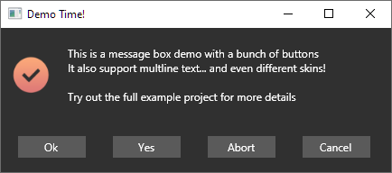

# MessageBoxSlim.Avalonia

A smaller more focused Version of  [MessageBox.Avalonia](https://github.com/CreateLab/MessageBox.Avalonia)

My goal was to build a cross-platform message box that doesn't try to be super fancy and also to remove a lot of unneeded complexity. This fork tries to create a more platform to platform default experience instand of extra features.



The major differences are:

-   Only one MessageBox Type. The removal of the custom message box is opionated but if you want custom buttons back that should be easy to add to the new class if you need it.
-   No prebaked Icons included. You can still use those from the Example but now the API expects that you have your own Icons
-   Code simplification, identifier are shorter and no longer clash with bultins
    -   Examples
        -   Show and ShowDialog are renamed to ShowAsync and ShowDialogAsync
        -   Style is now Called BoxStyle
-   A can only be constructed with the DTO Object
    -   I did this to keep things simple for now
-   The Button Parameter is now a bitfield. You can now combine every button combination you want. See the Example Project for Code Snippets.
-   Improved and simplified XAML Layout
-   Removed Header Property (Use Title instead)
-   Removed the colorful Buttons
-   A MessageBox will now by default be shown in the center of its owner
-   BitmapFactory for easy Bitmap loading from Code

I also expanded the Example Project to show the new API and different Styles.

This version is not on NuGet yet. If that changes I will update the README.

## Example Usage

```csharp
var result = await BoxedMessage.Create(new MessageBoxParams
{
	Buttons = ButtonEnum.Ok | ButtonEnum.Abort,
	ContentTitle = "Oh no",
	ContentMessage = "Oh no! Something went wrong :(",
	Location = WindowStartupLocation.CenterScreen,
	Icon = BitmapFactory.Load("avares://MessageBox.Avalonia.Example/Assets/plus.ico"),
	Style = BoxStyle.UbuntuLinux
}).ShowDialogAsync(this);
```

